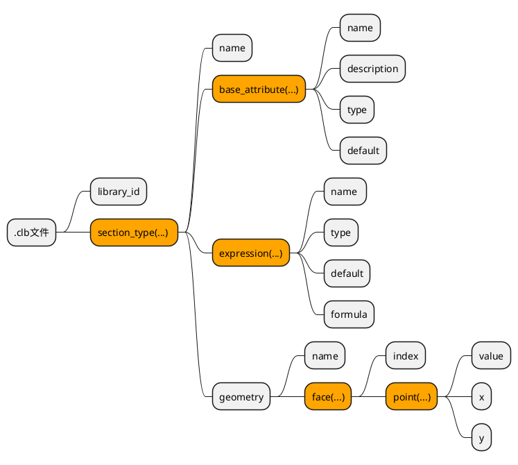

# tekla参数化截面

tekla支持通过`*.clb`文件创建自定义参数的截面；
通过设置`components.clb`文件导入自定义截面；
通过设置`profitab.inp`文件在`tekla structures`中显示导入的自定义截面；

## .clb截面文件格式

截面类型：用户定义的，有参数的。

文件路径：`..\ProgramData\Trimble\Tekla Structures\<version>\environments\common\inp`



### library_id

在 profitab.inp 文件中使用的库名称,如：

```
library_id "SJ"
```

### section_type

定义截面参数

#### name

在 profitab.inp 文件中使用的截面名称，如：
```
section_type
{
        name "SJSPHERE"
```

#### base_attribute

定义截面的参数，如：

```
base_attribute
{
name "d"
description "albl_Diameter"
type dimension
default 500
}
```

#### expression

定义在此截面定义中使用的变量，如：

```
expression
{
name "p1"
type dimension
formula 0.140*d
}
```

* formult 为变量的计算公式

可使用截面参数或已定义的变量。
已测试可用的函数有：+ - * / sin cos tan PI Min Max

* 截面定义中包含过多变量时，启动tekla structures程序会导致软件崩溃。

正常启动tekla structures时的最多变量个数：100。

#### geometry

定义实体顶点的位置，如：

```
geometry
{
    name "default"
    face
    {
        index 0
        point 0  y1  z1
        point 0  y1  z2
        point 0  y2  z2
        point 0  y4  z4
        point 0  y5  z3
        point 0  y3  z1
    }
}
```

* index : 面的编号，从0开始进行连续编号
* point.value : 0=梁的起始点，1=梁的终点。
* point.x ：此面上顶点的x值
* point.y ：此面上顶点的y值

顶点的排序规则为：从右下角开始，按逆时针顺序定义各个点。

### 注释

```
// this is a comment
```

## components.clb

文件路径：`..\ProgramData\Trimble\Tekla Structures\<version>\environments\common\inp`

```

//
// you can add your own library files here
//
include "Roundrect.clb"	// Circle to rectangle
include "RUNDRECHT.clb"	// Circle to rectangle

```

##  profitab.inp

文件路径:` ..\ProgramData\Trimble\Tekla Structures\<version>\environments\<environment>\`

```

/* Others
/*-------+------+----+---+----+----+------------------+------------------+
BLKS     ! USER ! 0  !   !  2 !  2 !1Gen.Sleeve       !d1-d2
CAP      ! USER ! 0  !   !  1 !  1 !CS.CAP            !d
HEMISPHER! USER ! 0  !   !  1 !  1 !TfrLib.HEMISPHER  !d
NUT_M    ! USER ! 0  !   !  1 !  1 !1Gen.Nut          !d
SJSPHERE ! USER ! 0  !   !  1 !  1 !1Gen.SJSPHERE     !d 
SPHERE   ! USER ! 0  !   !  1 !  1 !1Gen.SPHERE       !d                 !

```